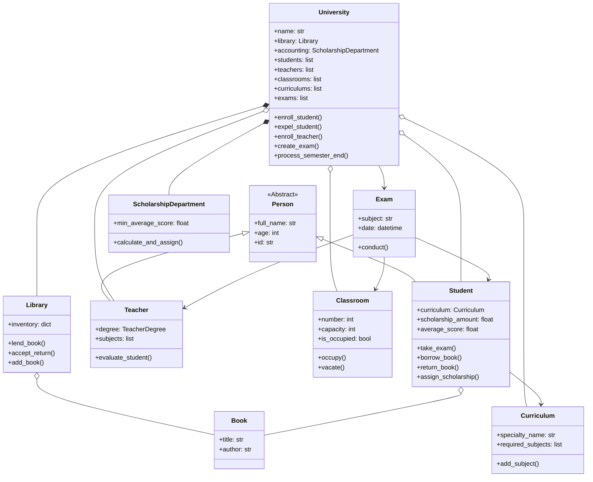
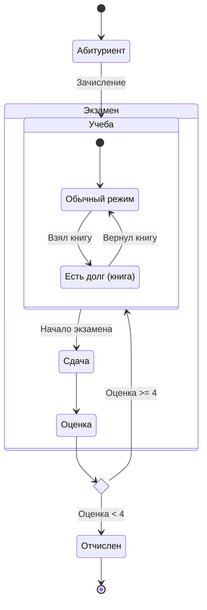

# Лабораторная работа №1: Модель университета
**Документация системы управления университетом**

## 1. Общее описание
Данная программная система представляет собой консольное приложение (CLI) для автоматизации процессов управления университетом. Система позволяет управлять списками студентов и преподавателей, учебными планами, аудиторным фондом, библиотекой, а также проводить экзамены и рассчитывать стипендии.

Проект реализован на языке Python с использованием объектно-ориентированного подхода.

## 2. Структура проекта
Файловая структура проекта организована следующим образом:

```
lab1/
├── CLI/                    # Интерфейс командной строки
│   └── main.py             # Точка входа в программу
├── sources/                # Основная бизнес-логика и модели данных
│   ├── __init__.py         # Инициализация пакета
│   ├── exceptions.py       # Пользовательские классы исключений
│   ├── handle_functions.py # Функции-обработчики для взаимодействия с пользователем
│   ├── models.py           # Основные сущности (Студент, Преподаватель, Книга и др.)
│   ├── storage.py          # Логика сохранения и загрузки данных (Persistence)
│   └── university.py       # Главный класс-контейнер University
├── tests/                  # Модульные тесты
│   └── tests.py            # Unit-тесты для проверки логики
├── .coveragerc             # Конфигурация для coverage.py
└── .gitignore              # Исключения для Git
```

## 3. Описание модулей
### 3.1. Пакет sources
#### models.py
Содержит определения основных сущностей системы, реализованных с помощью декоратора @dataclass.

- **Person (ABC)**: Абстрактный базовый класс для людей. Содержит ФИО, возраст и уникальный ID.
- **Student**: Наследуется от Person. Хранит учебный план, зачетку (словарь оценок), список взятых книг и размер стипендии.
- **Teacher**: Наследуется от Person. Хранит ученую степень (TeacherDegree) и список предметов, которые может вести.
- **Curriculum**: Учебный план. Содержит название специальности и список обязательных предметов.
- **Classroom**: Аудитория. Имеет номер, вместимость и статус занятости.
- **Book**: Книга в библиотеке (название, автор, ISBN). Класс является неизменяемым (frozen=True).
- **Library**: Управляет инвентарем книг (словарь Book -> quantity).
- **Exam**: Сущность экзамена. Связывает предмет, преподавателя, аудиторию и список студентов.
- **ScholarshipDepartment**: Отвечает за расчет стипендии на основе среднего балла.

#### university.py
Содержит класс University, который является агрегатором всех данных системы.

- Хранит списки студентов, преподавателей, аудиторий, учебных планов и экзаменов.
- Предоставляет методы для регистрации (enroll_student, enroll_teacher), отчисления (expel_student), создания экзаменов (create_exam) и управления ресурсами.

#### storage.py
Отвечает за персистентность данных (сохранение состояния между запусками).

- Использует модуль pickle для сериализации объектов.
- **Особенность реализации:** Используется атомарная запись. Данные сначала пишутся во временный файл (.tmp), и только после успешной записи файл переименовывается в основной (university_db.pkl). Это предотвращает потерю данных при сбоях.
- При отсутствии базы данных создается дефолтный университет с тестовыми данными.

#### handle_functions.py
Слой "Контроллера", связывающий ввод пользователя с логикой моделей.

- Содержит функции для каждого пункта меню (add_student, conduct_exam и т.д.).
- Реализует валидацию ввода (например, функция _get_int).
- Реализует "умный поиск" (_select_person), позволяющий находить студентов и преподавателей по части имени.

#### exceptions.py
Определяет иерархию ошибок для обработки исключительных ситуаций:

- **UniversityError** (базовый)
- **ResourceError** (нет книг, аудитория занята)
- **EnrollmentError** (студент не имеет плана, преподаватель не знает предмет)
- **StateError** (нарушение логики состояния)
- **StorageError** (ошибки файловой системы)

### 3.2. Пакет CLI
#### main.py
Точка входа в приложение.

- Настраивает sys.path, чтобы видеть пакет sourses из вложенной папки.
- Загружает данные при старте через storage.load_data().
- Содержит бесконечный цикл while True с выводом главного меню.
- Обрабатывает исключения и выводит понятные сообщения об ошибках пользователю.

### 3.3. Тестирование (tests/)
#### tests.py
Набор модульных тестов на базе библиотеки unittest.

- Покрывает тестами основные модели (Student, Library, University).
- Использует unittest.mock для имитации ввода-вывода, генератора случайных чисел и файловой системы.
- Проверяет сценарии успеха и граничные случаи (ошибки).

## 4. Ключевые алгоритмы и реализация
### Инкапсуляция
В классах используются приватные поля (с префиксом _) и свойства (@property) для доступа к ним. Это защищает внутреннее состояние объектов от некорректного изменения извне.

### Проведение экзамена (conduct_exam)
1. Пользователь выбирает предмет.
2. Система ищет преподавателя, компетентного в этом предмете.
3. Система ищет свободную аудиторию.
4. Формируется список студентов, у которых этот предмет есть в учебном плане (Curriculum).
5. Создается объект Exam.
6. Для каждого студента генерируется случайная оценка (1-10).
7. Если оценка < 4, студент попадает в список на отчисление.
8. После экзамена аудитория освобождается.

### Библиотека
Книги (Book) используются как ключи в словаре инвентаря. Для этого класс Book помечен как frozen=True, что делает его хешируемым.

## 5. Инструкция по запуску
### Требования
Python 3.8 или выше.

### Запуск приложения
Находясь в корневой директории проекта (Лаба 1), выполните команду:

```bash
python CLI/main.py
```

Запуск тестов
Для запуска unit-тестов выполните:
```bash
python tests/tests.py
```

Для проверки покрытия кода тестами (при установленном coverage):
```bash
coverage run -m unittest tests/tests.py
coverage report -m
```

## Диаграммы

### Диаграмма классов


### Диаграмма состояний (Жизненный цикл студента)

